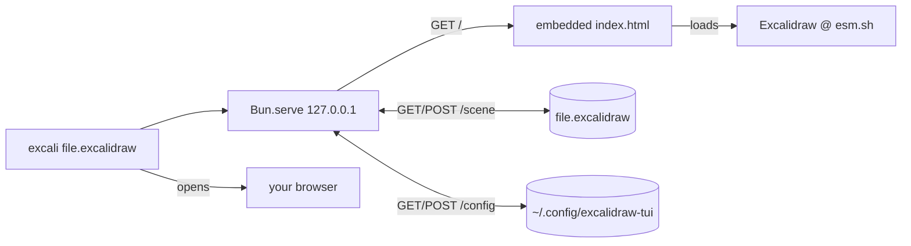

```
 ███████╗ ██╗  ██╗  ██████╗  █████╗  ██╗     ██╗
 ██╔════╝ ╚██╗██╔╝ ██╔════╝ ██╔══██╗ ██║     ██║
 █████╗    ╚███╔╝  ██║      ███████║ ██║     ██║
 ██╔══╝    ██╔██╗  ██║      ██╔══██║ ██║     ██║
 ███████╗ ██╔╝ ██╗ ╚██████╗ ██║  ██║ ███████╗ ██║
 ╚══════╝ ╚═╝  ╚═╝  ╚═════╝ ╚═╝  ╚═╝ ╚══════╝ ╚═╝
```

<div align="center">

### `THE REAL EXCALIDRAW // FROM YOUR TERMINAL`

*open a `.excalidraw` file with one command, edit in the browser, autosave back to disk*

    -777777?style=flat-square&labelColor=111111)

</div>

---

## 🎨 What is this

`excali` opens a `.excalidraw` file in the **genuine** Excalidraw web app — not a viewer, not a reimplementation, not an ASCII approximation — and saves your edits straight back to the file as you draw. You point it at a path, the drawing opens in your browser, and the terminal quietly becomes the autosave server until you Ctrl-C it.

It's one Bun script. No build step, no `node_modules`, no framework, no dependencies. Excalidraw itself is loaded from a CDN at runtime, so the whole thing that ships is ~120 lines of TypeScript and a single HTML host page — which gets embedded into the compiled binary, so what lands in `~/.bun/bin` is genuinely self-contained.

There was, briefly, a mode that rendered the whole app *inside* the terminal via a Chromium-in-a-terminal engine. It worked. It was also 130MB of dependency painting a precision vector canvas at the resolution of text characters. We held a small funeral and left.

```console
nick@excali:~$ excali diagram.excalidraw
[✓] excalidraw is open in your browser — edits autosave to diagram.excalidraw
[i] press ctrl-c here to stop. the terminal is the server now.
```

## 🖍 What it does

| | feature | what it actually does |
|---|---|---|
| 01 | **real excalidraw** | loads the genuine `@excalidraw/excalidraw` from esm.sh — every tool, shape, and shortcut, none of it reimplemented |
| 02 | **autosave** | writes edits back to the file ~500ms after you stop drawing, using excalidraw's own serializer |
| 03 | **won't corrupt your file** | every write is validated as JSON and rename-swapped atomically — a crash mid-save can't leave you half a drawing |
| 04 | **settings that stick** | theme, canvas background, grid, zen/view mode, snap — persisted globally, so dark mode survives every reload |
| 05 | **your libraries too** | imported `.excalidrawlib` items are saved alongside the prefs and reloaded with you |
| 06 | **new files** | a path that doesn't exist yet opens a blank canvas and is created on first save — no ceremony |

## 🚀 Run it

Needs [Bun](https://bun.sh) and a browser. Excalidraw loads from a CDN, so you'll want internet.

```bash
git clone https://github.com/nitrimandylis/excalidraw-tui.git
cd excalidraw-tui
./install.sh              # compiles to ~/.bun/bin/excali + installs the man page
excali drawing.excalidraw
```

Prefer to run from source without installing? `./excali.ts drawing.excalidraw` does the same thing straight through Bun. Set `EXCALI_NO_OPEN=1` to skip launching the browser (headless).

## 🔩 Under the hood



| file | job |
|---|---|
| `excali.ts` | the whole thing — CLI arg parsing + `Bun.serve` (host page, scene, config) in one file |
| `index.html` | the host page; mounts Excalidraw, wires autosave + persistence, embedded into the binary |
| `install.sh` | `bun build --compile` → `~/.bun/bin`, and drops the man page in your Homebrew manpath |
| `excali.1` | `man excali` |
| `excali.test.ts` | `bun test` — scene + config round-trip and the "malformed POST can't corrupt the file" guard |

**Stack:** Bun · TypeScript · a single HTML file · Excalidraw (borrowed) · zero dependencies

---

<div align="center">

**[Nick Trimandylis](https://github.com/nitrimandylis)**

`THE TERMINAL IS THE SERVER NOW`

MIT licensed — see [LICENSE](LICENSE).

</div>
